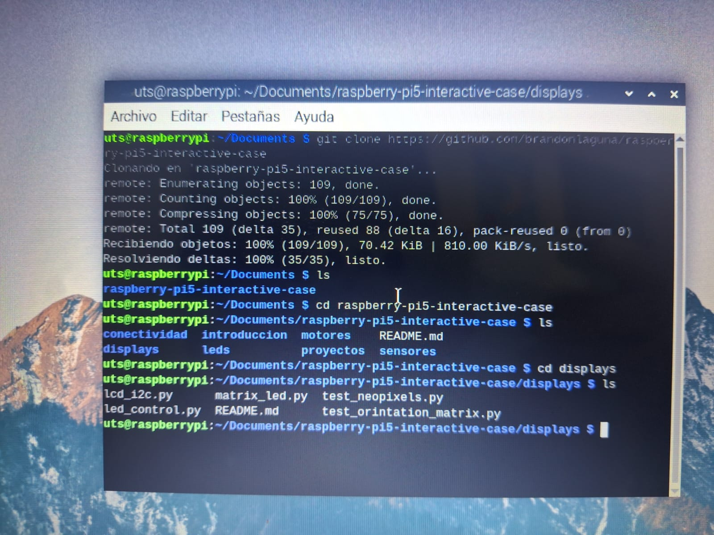
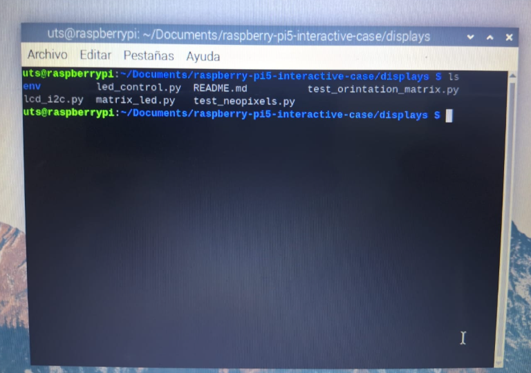
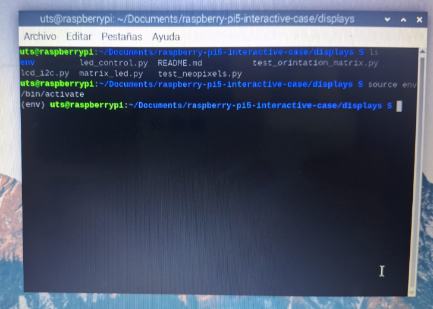
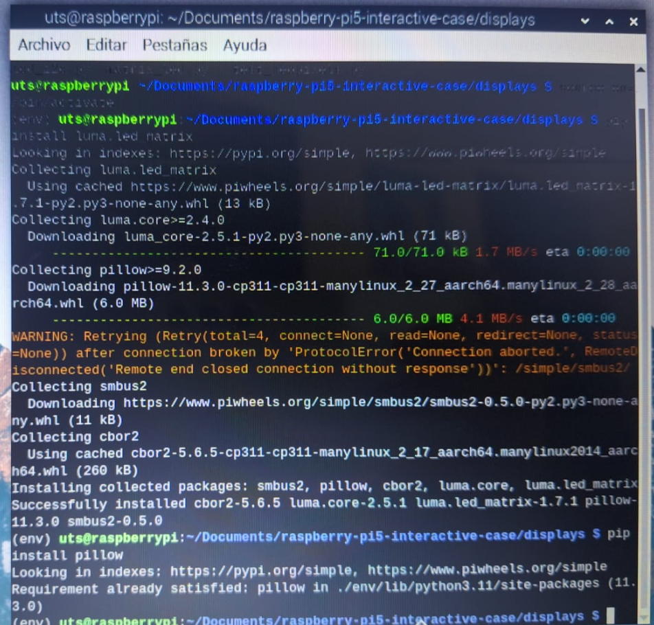
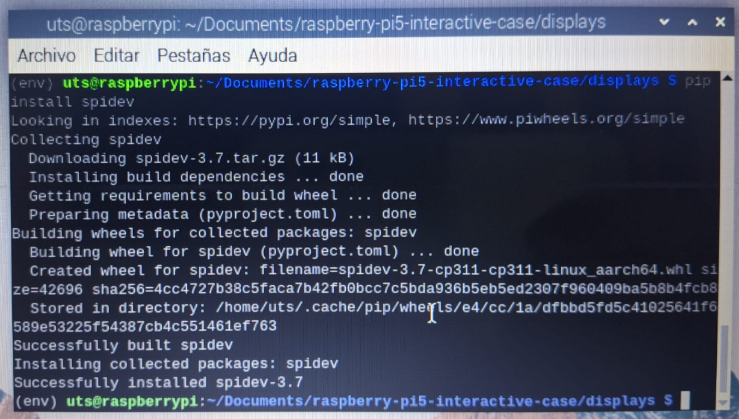
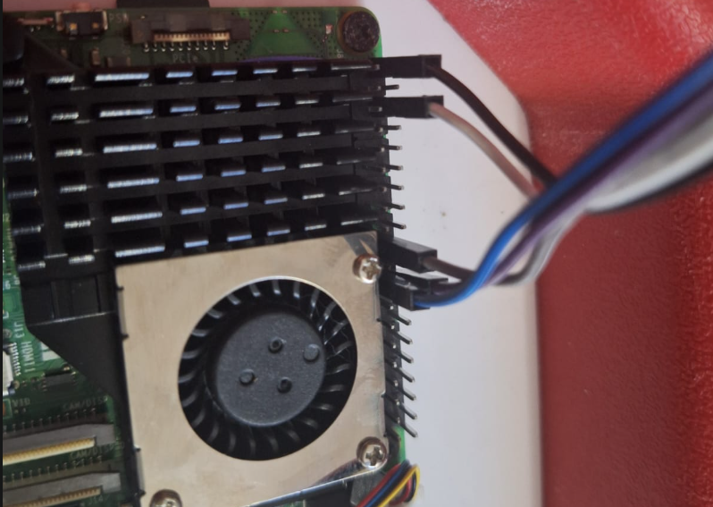
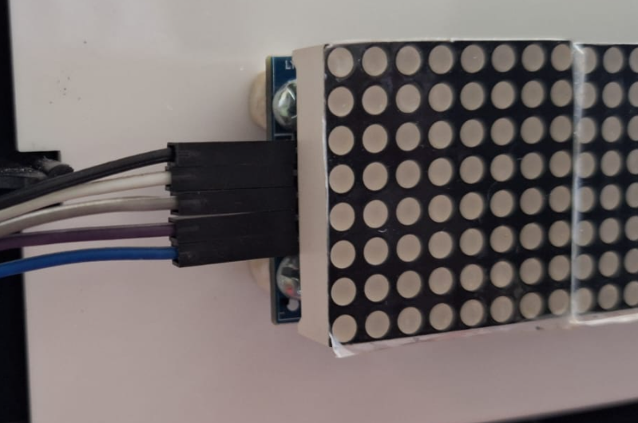
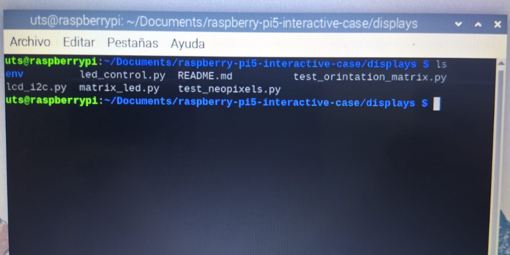
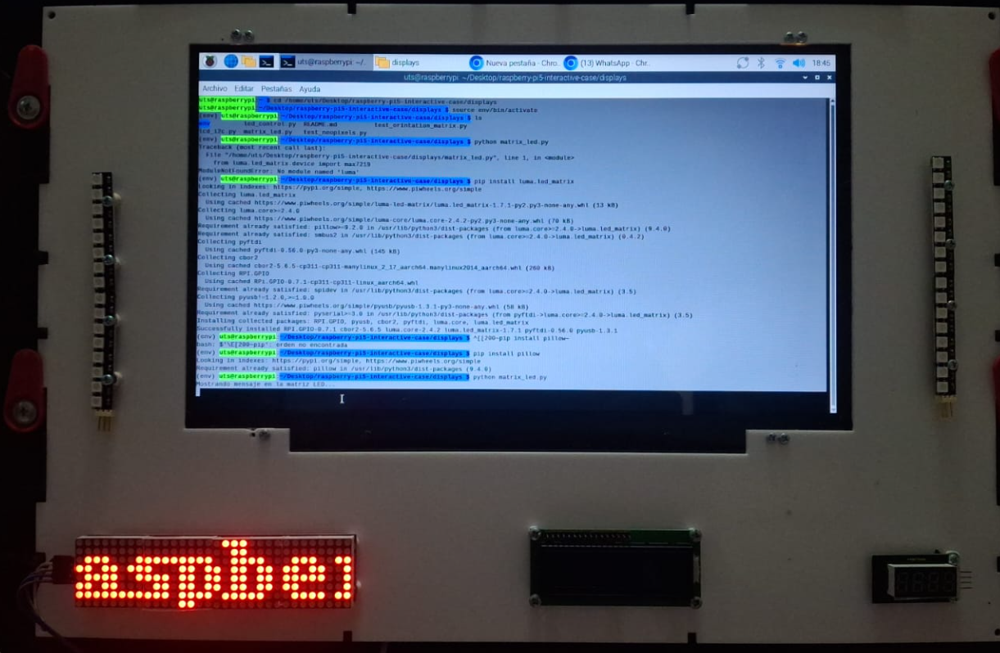

# 📺 Displays y Visualización de Datos

Este documento detalla las conexiones recomendadas para el funcionamiento de dos tipos de displays:

1. **LCD 16x2 con módulo I2C**
2. **Módulo de 4 matrices LED 8x8 (MAX7219) vía SPI**

Esta carpeta contiene ejemplos prácticos para la conexión y uso de **displays en Raspberry Pi 5**, permitiendo mostrar datos obtenidos desde sensores o scripts personalizados.

Los módulos utilizados se conectan por **I2C o SPI** y permiten visualizar texto, símbolos o mensajes en tiempo real.

---

## 📂 Archivos incluidos

| Archivo         | Descripción                                           |
| --------------- | ----------------------------------------------------- |
| `lcd_i2c.py`    | Muestra texto en una pantalla LCD 16x2 I2C            |
| `matrix_led.py` | Muestra texto desplazable en módulo LED 8x8 (MAX7219) |
| `README.md`     | Este archivo, con la documentación del uso            |

---

## 🔧 Requisitos de hardware

| Componente                  | Detalles                          |
| --------------------------- | --------------------------------- |
| Raspberry Pi 5              | GPIO habilitado, I2C/SPI activos  |
| Pantalla LCD 16x2 + I2C     | Módulo con dirección común `0x27` |
| Módulo LED 8x8 x4 (MAX7219) | Conexión SPI estándar             |
| Cables jumper               | Para conexión de los displays     |

---

# 1. Módulo de 4 matrices LED 8x8 (MAX7219) – SPI

## 1.1 :busstop: Creacion de ambiente

Creacion de ambiente de desarrollo, (env) \*importante para efectos de mantener el ecosistema de raspberry pi os de las dependencias innecesarias y evitar conflictos al momento de usar los pines GPIO

- la terminal debe estar ubicada en la carpeta de displays como en el siguiente ejemplo.

```bash
uts@raspberrypi:~/Documents/raspberry-pi5-interactive-case/displays $
```

- Si no es asi es necesario usar el siguiente comando para ingresar a la carpeta

```bash
cd /Documents/raspberry-pi5-interactive-case/displays
```



> Una vez dentro de la carpeta **displays** procedemos a crear un ambiente de desarrollo y a activarlo

- Creacion

```bash
python3 -m venv env
```

Este comando creará una carpeta nueva la cual tiene toda la configuracion necesaria para la ejecucion de este proyecto

- Verificacion

Para verificar que la carpeta **env** se haya creado correctamente usa el comando

```bash
ls
```



> Podemos visualizar una nueva carpeta de color azul llamada env, esto significa que ha sido creada correctamente

- Activacion

```bash
source env/bin/activate
```

Este comando activará el ambiente y podemos visualizarlo en la terminal, al costado izquierdo del usuario de la terminal se puede observar **(env)** lo cual indicará que estamos dentro de un ambiente virtual para pruebas



## 1.2 📦 Instalación de dependencias

Instala las bibliotecas necesarias para los dos tipos de pantallas:

> Ejecutar cada linea a la vez

```bash
pip install luma.led_matrix
pip install pillow
pip install spidev
```





---

## 1.3 Conexiones de Displays para Raspberry Pi 5

Para el módulo MAX7219, se recomienda conectar según la siguiente tabla:

| Señal         | Conexión en Raspberry Pi | Numero de pin |
| ------------- | ------------------------ | ------------- |
| DIN (Data In) | GPIO 10 (MOSI)           | 19            |
| CS            | GPIO 8 (CE0)             | 24            |
| CLK           | GPIO 11 (SCLK)           | 23            |
| VCC           | 5V                       | 2 ó 4         |
| GND           | GND                      | 6             |

> **Importante:**
>
> - Asegúrate de habilitar el modo SPI en tu Raspberry Pi.
> - El módulo se comunica vía SPI, por lo que es necesario que la interfaz esté activa.
>   Para ello, puedes activarla desde la terminal `sudo raspi-config → Interfacing Options → SPI → Enable`.



> Conexion pines GPIO Raspberry Pi 5



> Conexion modulo MAX7219

## 1.4 Ejecucion del script de prueba

Posicionada la terminal en la carpeta `raspberry-pi5-interactive-case/displays` podemos nuevamente listar los archivos que en esta contiene con el comando:

```bash
ls
```



Ahora podemos realizar la ejecucion del archivo llamado `matrix_led.py` con python desde la terminal.

```bash
python matrix_led.py
```

vamos a poder ver que en la consola se imprime un mensaje que dice `Mostrando mensaje en la matriz LED...`

y el modulo MAX7219 se visualizará el mensaje `Raspberry Pi 5`



## 1. LCD 16x2 (I2C)

Conecta el display LCD con el adaptador I2C de la siguiente forma:

| Señal | Conexión en Raspberry Pi |
| ----- | ------------------------ |
| SDA   | GPIO 2 (Pin 3)           |
| SCL   | GPIO 3 (Pin 5)           |
| VCC   | 5V                       |
| GND   | GND                      |

> **Nota:** Puedes utilizar el comando `sudo i2cdetect -y 1` para verificar la dirección I2C (generalmente `0x27`).

---

Con estas conexiones, podrás integrar ambos displays en tu proyecto basado en Raspberry Pi 5. Si necesitas ajustar direcciones o pines según tu esquema específico, revisa la documentación del módulo o del adaptador utilizado.

```

```
