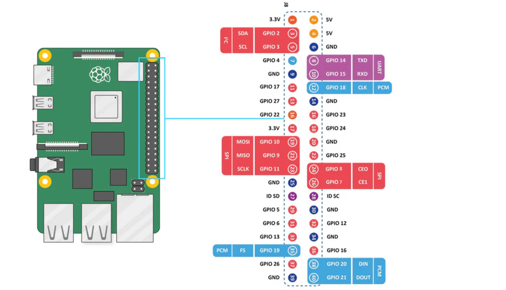

# Introduccion

# Introducción a la Maleta Interactiva

## 💡 Objetivo

Este manual tiene como finalidad familiarizarte con la **Maleta Interactiva** y la **Raspberry Pi 5**, enseñándole a encenderla, navegar en su sistema y ejecutar tu primer programa en Python.

## 📚 Contenido

1. ¿Qué es la Maleta Interactiva?
2. Componentes principales
3. Encendido y configuración inicial
4. Uso de la terminal y comandos básicos
5. Instalación de herramientas necesarias
6. Primer programa en Python

---

## 1. ¿Qué es la Maleta Interactiva?

La **Maleta Interactiva** es un kit didáctico basado en **Raspberry Pi 5** equipado con sensores, displays, servos y otros módulos. Su objetivo es permitir clases teórico-prácticas de electrónica y programación.

## 2. Componentes principales

Dentro de la maleta encontrarás:

- 🧵 **Raspberry Pi 5**
- 💻 **Pantalla y teclado**
- 🛠 **Protoboard y cables**
- 🎨 **Displays (LCD y 7 segmentos)**
- 🔌 **Sensores (temperatura, proximidad, luz, etc.)**
- 🛠 **Relays y servos**

## 2.1 Conociendo la Raspberry pi 5



### Pines de alimentacion

- **5V:** (X2) Pines de 5V para alimentar dispositivos externos
- **3.3V:** (X1) Pin de 3.3V para alimentar sipositivos externos que requieran esta tension
- **GND:** (X8) Pines de tierra para completar los circuitos

### Pines GPIO (Entradas/Salidas de proposito general)

- **Conector:** la placa tiene 40 pines GPIO
- **Funcionalidad:** Estos pines permiten configurar entradas y salidas digitales para controlar dispositivos externos. 
- **Tensión:** Los pines GPIO soportan 3.3V y no son tolerantes a tensiones de 5V, por lo que es importante tenerlo en cuenta al conectar dispositivos externos.


## 3. Encendido y configuración inicial

### 🔄 Pasos para encender la Raspberry Pi 5

1. Conecta la pantalla y el teclado a la Raspberry Pi.
2. Inserta la tarjeta microSD con Raspberry Pi OS instalado.
3. Conecta la alimentación.
4. Espera a que el sistema arranque y sigue las instrucciones en pantalla.

## 4. Uso de la terminal y comandos básicos

Para abrir la terminal, presiona **CTRL + ALT + T** y prueba los siguientes comandos:

```bash
ls  # Lista archivos y carpetas
pwd  # Muestra la ubicación actual
cd <nombre_carpeta>  # Cambia de directorio
python3 --version  # Verifica la versión de Python
```

## 5. Instalación de herramientas necesarias

Ejecuta el siguiente comando para asegurarte de que todo esté actualizado:

```bash
sudo apt update && sudo apt upgrade -y
```

Instala librerías útiles para trabajar con los sensores y actuadores:

```bash
pip install RPi.GPIO numpy matplotlib
```

## 6. Primer programa en Python

Crea un archivo de prueba escribiendo:

```bash
echo 'print("👋 Hola, Maleta Interactiva!")' > hola.py
python3 hola.py
```

Si todo está correcto, verás en pantalla:

```
👋 Hola, Maleta Interactiva!
```

---

## 📈 Conclusión

Ahora ya conoces la maleta, su hardware y la Raspberry Pi. En el siguiente manual, aprenderás a usar sensores y leer datos en tiempo real.

---

📖 **Siguiente Manual:** [Sensores Básicos](../sensores/README.md)
