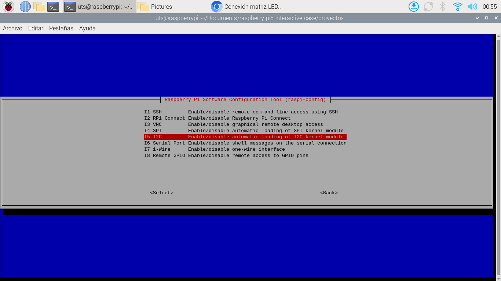
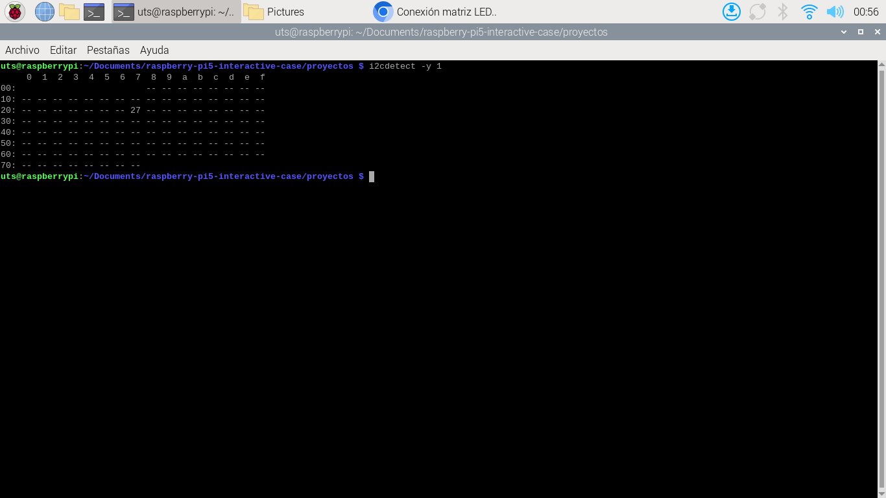

# :hammer: Proyectos

Este documento detalla las conexiones, configuraciones e instalaciones para poder ejecutar los distintos proyectos mencionados aqui.

1. Proyecto solicitud contraseña para activar relé
2. Proyecto

Esta carpeta contiene ejemplos practicos para la conexion y uso del:

- Teclado matricial
- LCD 16x2 I2C
- Relé

---

## 📂 Archivos incluidos

| Archivo                    | Descripción                                      |
| -------------------------- | ------------------------------------------------ |
| `num_keyboard_password.py` | Proyecto ingreso de contraseña para activar relé |
| `README.md`                | Este archivo, con la documentación del uso       |

---

## 🔧 Requisitos de hardware

| Componente                        | Detalles                                                                                        |
| --------------------------------- | ----------------------------------------------------------------------------------------------- |
| Raspberry Pi 5                    | GPIO habilitado, I2C/SPI activos                                                                |
| Pantalla LCD 16x2 + I2C           | Módulo con dirección común `0x27`                                                               |
| Teclado Matricial de membrana 3x4 | Conexion Standard GPIO                                                                          |
| Relé                              | Dispositivo electromecánico que funciona como un interruptor controlado por una señal eléctrica |
| Cables jumper                     | Para conexión de los displays                                                                   |

---

# 1. Proyecto de ingreso de contraseña para activar o desactivar relé

## 1.1 :inbox_tray: Instalacion de librerias globales

En este punto se instalarán los paquetes esenciales, los cuales tendrán compatibilidad con los pines _GPIO_ en la _Raspberry Pi 5_ y el sistema operativo _Raspberry Pi Os_

- Actualizacion de la lista de paquetes disponibles y sus versiones

```bash
sudo apt update
```

- Instalacion de paquetes

```bash
sudo apt install -y python3-lgpio python3-rpi-lgpio i2c-tools python3-smbus
```

> Dependencias GPIO/I2C (rpi-lgpio shim + lgpio)

## 

```bash
sudo apt install -y python3-lgpio python3-rpi-lgpio i2c-tools python3-smbus
```

---

## 1.2 :computer: Configuracion del sistema

En este punto se mencionarán las configuraciones que deba realizarse para poder acceder a las caracteristicas I2C que permiten el uso de pantallas

- Abrir menu de configuracion de Raspberry Pi 5

```bash
sudo raspi-config
```

- Habilitar Interfaz I2C (si aún no está)

## 

> Interfacing Options -> I2C -> Enable

## 

> Activar

## 

- Reiniciar

```bash
sudo reboot
```

- Verificacion de modulo I2C

Con el paquete _i2c-tools_ podemos hacer uso de la herramienta _i2cdetect_ y conocer la direccion en que está ubicado el dispositivo

```bash
i2cdetect -y 1
```

Te mostrará una tabla, y deberías ver un número hexadecimal como 27 o 3F → esa es la dirección I²C del LCD.

## 

> Configuraciones posibles 0x27 o 0x3F

---

## 1.3 :busstop: Creacion de ambiente

Creacion de ambiente de desarrollo, (env) _importante_ para efectos de mantener el ecosistema de raspberry pi os de las dependencias innecesarias y evitar conflictos al momento de usar los pines GPIO

En este proyecto que requiere un nivel de complejidad alto y que requiere las caracteristicas de la placa Raspberry Pi 5

- la terminal debe estar ubicada en la carpeta de proyectos como en el siguiente ejemplo.

```bash
uts@raspberrypi:~/Documents/raspberry-pi5-interactive-case/proyectos $
```

- Si no es asi es necesario usar el siguiente comando para ingresar a la carpeta

```bash
cd /Documents/raspberry-pi5-interactive-case/proyectos
```

> se recomienda tener la carpeta del proyecto en Documents

## 

- Creacion

```bash
python3 -m venv env --system-site-packages
```

> --system-site-packages permite que el ambiente de desarrollo tenga las referencias de los paquetes instalados en el sistema

- Activacion

```bash
source env/bin/activate
```

> Este comando accede a la carpeta (env) creada por la instruccion anterior

## 

---

## 1.4 :open_file_folder: Insatalacion de dependencias de entorno

En este punto solo queda instalar las dependencias que trabajaran a nivel de entorno, ya que no requieren de permisos especificos de la placa Raspberry Pi, y son las que ayudan a controlar el display LCD I2C 16\*2

```bash
pip install RPLCD smbus2
```

## 

---

## 1.5 :round_pushpin: Coneccion de modulos

En este punto se especificará en que pines debe ir conectado los modulos y sensores a la placa Raspberry Pi 5

- LCD I2C 16x2
  | Pin Modulo | Conexión en Raspberry Pi | Pin Fisico |
  | - | - | - |
  | SDA | GPIO2 | 3 |
  | SCL | GPIO3 | 5 |
  | VCC | VCC | 2 o 4 |
  | GND | GND | 6 |

- Teclado Membrana 3x4
  | Pin Modulo | Conexión en Raspberry Pi | Pin Fisico |
  | - | - | - |
  | Filas: R1 | GPIO17 | 11 |
  | R2 | GPIO27 | 13 |
  | R3 | GPIO22 | 15 |
  | R4 | GPIO5 | 29 |
  | Columnas: C1 | GPIO6 | 31 |
  | C2 | GPIO13 | 33 |
  | C3 | GPIO19 | 35 |

- Relé
  | Pin Modulo | Conexión en Raspberry Pi | Pin Fisico |
  | - | - | - |
  | IN | GPIO21 | 40 |
  | VCC | 5V | 2 o 4 |
  | GND | GND | 6 |

- Conexion Raspberry Pi 5

## 

## 

- Conexion Teclado Membrana 3x4

## 

- Conexion Display LCD y Relé

## 

- Conexion Relé

## 

---

## 1.6 :wrench: Configurar Script

En este punto se requiere hacer una configuracion al script de python, el modulo I2C del display LCD, para este ejercicio de hará uso de un paquete instalado previamente llamado _i2c-tools_

En una terminal de comandos nueva ejecutamos el siguiente comando

```bash
i2cdetect -y 1
```

este comando mostrará una tabla de codigos Hexadecimales como la siguiente

## 

> Este comando muestra en la matriz 27 en la fila 20 y columna 07, eso significa que el dispositivo I2C que tienes conectado (en este caso, el módulo adaptador del LCD) está respondiendo en la dirección hexadecimal 0x27 en el bus I2C número 1.

¿Qué significa esto para tu script?
En el código donde inicializas el LCD con RPLCD o librerías similares, debes usar:

```python
I2C_ADDR = 0x27
```

Otras direcciones posibles
Dependiendo del chip adaptador (generalmente un PCF8574 o PCF8574A), podrías encontrar valores como:

- 0x27 (PCF8574 común, sin modificar jumpers de dirección)

- 0x3F (muy habitual en otras placas I²C LCD)

- 0x20, 0x21, 0x38, etc. (si se cambian puentes de configuración A0, A1, A2 en el módulo)

También, si hay más de un dispositivo I2C conectado, i2cdetect mostrará más de una celda ocupada.

---

## 1.7 :checkered_flag: Eejecucion de script

En este punto realizaremos finalmente la ejecion del codigo y realizar pruebas a este proyecto.

Con la terminal de comandos ubicada en la carpeta _Proyectos_ dentro del manual digital, y tambien visualizando que en la terminal está activo el ambiente de pruebas (env) y debe verse como:

```env
(env) uts@raspberrypi:~/Documents/raspberry-pi5-interactive-case/proyectos
```

## 

con el comando _ls_ puedes visualizar todos los archivos que contiene esta carpeta

```bash
ls
```

## 

Aqui podemos visualizar el archivo num_keyboard_password.py en la lista de archivos, podemos seleccionar el texto y copiarlo de la siguiente forma para ejecutarlo con el compilador de python

```bash
python num_keyboard_password.py
```

podemos ver en la pantalla LCD el texto "Ingrese Clave", la clave correcta para activar el Relé es 1234

- ## 

- ## 

### Exitos...
